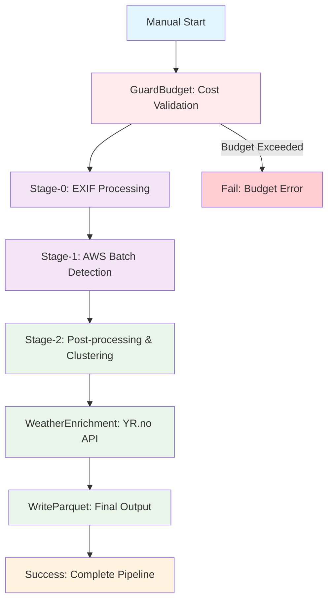

# 🐦‍⬛ Odins Ravne - Swedish Wildlife Intelligence System

[](https://www.python.org/downloads/release/python-3130/)
[](https://opensource.org/licenses/MIT)
[](https://aws.amazon.com/)
[](https://www.docker.com/)

**Munin** (Memory Keeper) samler og bevarer vildtdata fra kameraer, mens **Hugin** (Thought Bringer) giver dyb indsigt og forståelse af dyrelivet. **Odin** (All-Father) orchestrerer det hele.

## 🎯 System Overview

Odins Ravne er et omfattende system til svensk vildtmonitorering der kombinerer:

- **Munin**: Data indtagelse, procesering og lagring (Stage 0-2)
- **Hugin**: Analyse, indsigt og visualisering (Stage 2+)
- **Odin**: All-Father - Infrastruktur management og orchestration

## 🚀 Quick Start

### Prerequisites
```bash
# Python 3.13+
python3 -m venv .venv
source .venv/bin/activate
pip install -r requirements.txt

# AWS CLI (for production)
pip install awscli
aws configure
```

### Local Development
```bash
# Start LocalStack
make up-localstack

# Deploy infrastructure
make deploy-local

# Run pipeline
make run-local
```

### Production (AWS)
```bash
# Deploy to AWS (EU-NORTH-1)
make deploy-aws

# Upload test data
python scripts/upload_test_data_aws.py --bucket wildlife-pipeline-test

# Run pipeline in AWS
make run-aws
```

### Weather Integration
```bash
# Test weather enrichment
python -m src.munin.cli weather --input /path/to/data --output /path/to/output

# Test MET weather API
python -m src.munin.cli weather --provider met --location "Stockholm"

# Test YR weather API  
python -m src.munin.cli weather --provider yr --location "Stockholm"
```

## 🏗️ Architecture

### Step Functions Workflow


## 📁 Project Structure

```
├── src/                     # Source code
│   ├── common/             # Shared functionality
│   ├── odin/               # All-Father (Infrastructure)
│   │   ├── aws/            # AWS infrastructure
│   │   │   ├── infrastructure/ # CloudFormation templates
│   │   │   ├── lambdas/     # Lambda functions
│   │   │   └── batch/       # Batch job definitions
│   │   └── local/          # Local development
│   ├── munin/              # Memory Keeper (Data Processing)
│   │   ├── weather/        # Weather enrichment
│   │   ├── detection/      # Object detection
│   │   └── processing/     # Data processing
│   └── hugin/              # Thought Bringer (Analytics)
├── conf/                   # Configuration
│   ├── profiles/           # Environment profiles
│   ├── docker/             # Docker configurations
│   └── infrastructure/     # Infrastructure configs
├── src/odin/aws/infrastructure/ # AWS Infrastructure as Code
│   ├── cloudformation/     # CloudFormation templates
│   ├── batch/              # AWS Batch configurations
│   └── stepfn/             # Step Functions definitions
├── src/odin/aws/lambdas/   # Lambda functions
│   ├── guard_budget/       # Budget validation
│   ├── stage0_exif/        # EXIF processing
│   ├── stage2_post/        # Post-processing
│   ├── weather_enrichment/ # Weather data
│   └── write_parquet/      # Output formatting
├── docker/                 # Docker configurations
├── scripts/                # Utility scripts
│   ├── infrastructure/     # AWS deployment scripts
│   └── quality/            # Code quality tools
├── test/                   # Test files
├── test_data/              # Test data and samples
├── docs/                   # Documentation
└── dist/                   # Lambda deployment packages
```

## 🐦‍⬛ Components

### ⚡ Odin (All-Father)
**Infrastructure management and orchestration**

- AWS infrastructure setup and teardown
- Local development with Docker
- Pipeline orchestration
- Cost optimization
- Resource management

**CLI Commands:**
```bash
# Infrastructure Management
python -m src.odin.cli infrastructure setup
python -m src.odin.cli infrastructure status

# Pipeline Execution
python -m src.odin.cli pipeline run
python -m src.odin.cli pipeline stage1
```

### 🐦 Munin (Memory Keeper)
**Data ingestion, processing and storage (Stage 0-2)**

- Stage 0: Video frame extraction and analysis
- Stage 1: Object detection (positive observations)
- EXIF metadata processing
- GPS location classification
- Weather enrichment (MET & YR APIs)
- Cloud-optional architecture

**CLI Commands:**
```bash
# Data Processing
python -m src.munin.cli ingest /path/to/images /path/to/output
python -m src.munin.cli detect --input /path/to/images --output /path/to/output

# Weather Enrichment
python -m src.munin.cli weather --input /path/to/data --output /path/to/output
python -m src.munin.cli weather --provider met --location "Stockholm"
python -m src.munin.cli weather --provider yr --location "Stockholm"
```

### 🧠 Hugin (Thought Bringer)
**Analysis, insight and visualization (Stage 2+)**

- Stage 2.1: Human or animal detection
- Stage 2.2: Species detection
- Stage 2.3: GPS clustering and data condensation
- Stage 2.4: Cluster enrichment with names
- GPS proximity clustering (5m radius)

**CLI Commands:**
```bash
# Analytics
python -m src.hugin.cli analyze /path/to/data
python -m src.hugin.cli cluster process observations.json
```

## 🛠️ Technology Stack

### Core Technologies
- **Python 3.13**: Main development language
- **PyTorch**: Machine learning framework
- **YOLOv8**: Object detection models
- **OpenCV**: Image/video processing
- **AWS**: S3, Batch, Lambda, Step Functions, CloudFormation

### Cloud Technologies
- **AWS**: S3, Batch, ECR, CloudFormation, Step Functions, Lambda
- **Docker**: Containerization (cattle principle - stateless)
- **LocalStack**: AWS API emulator
- **MinIO**: S3-compatible storage
- **Redis**: Caching and job queues
- **PostgreSQL**: Metadata storage

### Weather Integration
- **MET.no API**: Norwegian weather data
- **YR.no API**: Swedish weather data
- **Weather enrichment**: Automatic weather data for observations
- **GPS clustering**: Location-based weather matching

## 📊 Current Status

### ✅ Completed
- Core pipeline implementation (Stage 0-2)
- Swedish wildlife detection optimization
- Video processing with frame extraction
- Multiple wildlife detector models
- Cloud-optional architecture
- AWS infrastructure setup (CloudFormation)
- Weather integration (MET & YR APIs)
- Docker cattle principle (stateless containers)
- AWS cleanup and production readiness
- Security implementation
- Comprehensive testing
- Lambda functions for AWS deployment
- Step Functions orchestration

### 📋 Roadmap
See [ROADMAP.md](docs/ROADMAP.md) for detailed development plan.

## 🔧 Setup & Deployment

- **Local Setup**: [LOCAL_SETUP.md](docs/LOCAL_SETUP.md)
- **AWS Infrastructure**: [src/odin/aws/infrastructure/README.md](src/odin/aws/infrastructure/README.md)
- **Lambda Functions**: [src/odin/aws/lambdas/README.md](src/odin/aws/lambdas/README.md)
- **Step Functions**: [docs/STEP_FUNCTIONS_ARCHITECTURE.md](docs/STEP_FUNCTIONS_ARCHITECTURE.md)
- **Cost Optimization**: [COST_OPTIMIZATION.md](docs/COST_OPTIMIZATION.md)
- **Utilities & Tools**: [UTILITIES.md](docs/UTILITIES.md)

## 🚀 AWS Deployment

### Prerequisites
```bash
# AWS CLI configured
aws configure

# Deploy infrastructure
make deploy-aws

# Upload test data
python scripts/upload_test_data_aws.py --bucket wildlife-pipeline-test
```

### Production Features
- **CloudFormation**: Infrastructure as Code
- **Step Functions**: Pipeline orchestration
- **Lambda Functions**: Serverless processing
- **AWS Batch**: Scalable compute
- **S3**: Data storage and retrieval
- **Weather APIs**: MET.no and YR.no integration

## 🤝 Contributing

1. Fork repository
2. Create feature branch
3. Make your changes
4. Add tests
5. Submit pull request

## 📄 License

This project is licensed under MIT License - see LICENSE file for details.

## 🐦‍⬛ Odins Ravne Team

- **Munin**: Memory Keeper - Data ingestion and processing
- **Hugin**: Thought Bringer - Analysis and insight
- **Odin**: All-Father - Overall system architecture

---

**Odins Ravne** - Bringing wisdom to wildlife protection through technology.