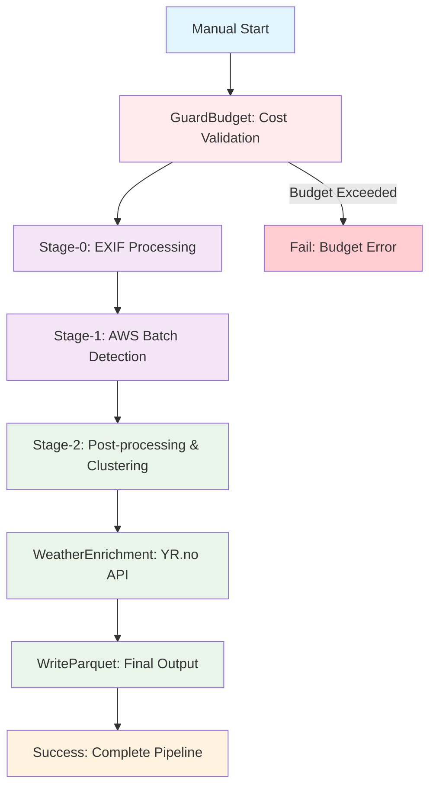
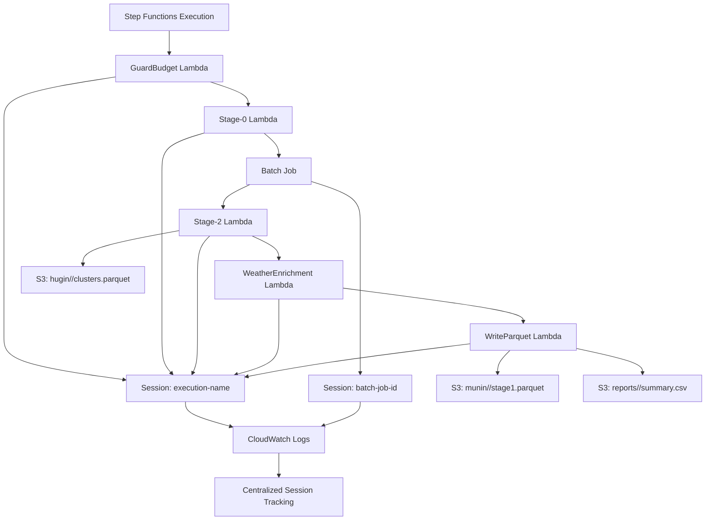

# 🐦‍⬛ Odins Ravne - Swedish Wildlife Intelligence System

[](https://www.python.org/downloads/release/python-3110/)
[](https://github.com/pre-commit/pre-commit)
[](https://opensource.org/licenses/MIT)
[](https://github.com/psf/black)
[](https://pycqa.github.io/isort/)
[](https://pep8.readthedocs.io/)
[](https://pytest.org/)
[](https://aws.amazon.com/)
[](https://www.docker.com/)

**Munin** (Memory Keeper) samler og bevarer vildtdata fra kameraer, mens **Hugin** (Thought Bringer) giver dyb indsigt og forståelse af dyrelivet.

## 🎯 Projekt Oversigt

Odins Ravne er et omfattende system til svensk vildtmonitorering der kombinerer:
- **Munin**: Data indtagelse, procesering og lagring (Stage 0-2)
- **Hugin**: Analyse, indsigt og visualisering (Stage 2+)
- **Odin**: All-Father - Infrastruktur management og orchestration

## 🔄 System Workflow - Step Functions Architecture



### 🎯 **New Step Functions Workflow**

The pipeline is now orchestrated as a **manual, budget-controlled AWS Step Functions workflow**:

1. **GuardBudget** - Validates cost estimates before starting
2. **Stage-0** - EXIF data extraction and time correction (Lambda)
3. **Stage-1** - Wildlife detection via AWS Batch (spot instances)
4. **Stage-2** - Post-processing and GPS clustering (Lambda)
5. **WeatherEnrichment** - Weather data enrichment for positive observations (Lambda)
6. **WriteParquet** - Final output generation (Lambda)

### Workflow Stages

**Munin (Memory Keeper)**:
- **Stage 0**: Video frame ekstraktion og analyse
- **Stage 1**: Objekt detektion (positive observations)
- **Done**: Munin er færdig når der er konstateret positive observations

**Hugin (Thought Bringer)**:
- **Stage 2.1**: Menneske eller dyr detection
- **Stage 2.2**: Species detection (hvilket dyr)
- **Stage 2.3**: Dan cluster og data observations
- **Stage 2.4**: Berig med cluster navn for pretty reporting

## 🚀 Hurtig Start

### Forudsætninger
```bash
# Python 3.9+
pip install -r requirements.txt

# For GPU support (valgfrit)
pip install torch torchvision --index-url https://download.pytorch.org/whl/cu118
```

### Lokal Udvikling
```bash
# Odin - Infrastruktur Management
src/odin/cli.py --config conf/profiles/local.yaml infrastructure setup
src/odin/cli.py --config conf/profiles/local.yaml pipeline run

# Munin - Data Indtagelse
cd src/munin/
pip install -e .
munin ingest /path/to/images /path/to/output

# Hugin - Analyse
cd src/hugin/
pip install -e .
hugin analyze /path/to/data
```

### Cloud Deployment
```bash
# Odin - AWS Infrastructure
src/odin/cli.py --config conf/profiles/cloud.yaml infrastructure setup
src/odin/cli.py --config conf/profiles/cloud.yaml pipeline run

# AWS Setup (Legacy)
scripts/infrastructure/deploy_aws_infrastructure.py
scripts/infrastructure/create_aws_test_user.py

# Deploy to AWS Batch
src/odin/cli.py batch --input s3://your-bucket/input --output s3://your-bucket/output
```

## 🏗️ **Step Functions Architecture**

### **New AWS Step Functions Workflow**

The pipeline is now orchestrated as a **manual, budget-controlled AWS Step Functions workflow**:

#### **Local Development (LocalStack)**
```bash
# Start LocalStack
make up-localstack

# Deploy to LocalStack
make deploy-local

# Run pipeline locally
make run-local
```

#### **Production (AWS)**
```bash
# Deploy to AWS
make deploy-aws

# Run pipeline in AWS
make run-aws
```

#### **Cleanup**
```bash
# Stop LocalStack
make down-localstack

# Destroy local resources
make destroy-local
```

### **Step Functions Components**

- **`infra/stepfn/state_machine.asl.json`** - Step Functions state machine definition
- **`lambdas/`** - Lambda handlers for each stage
- **`infra/batch/`** - AWS Batch configuration for Stage-1 detection
- **`docker/munin-detector/`** - Docker image for Batch jobs
- **`infra/cloudformation/`** - Complete AWS infrastructure template

## 📁 Projekt Struktur

```
├── src/                     # Source code
│   ├── common/             # 🆕 Shared functionality
│   │   ├── core/           # Base classes & configuration
│   │   ├── exceptions/      # Custom exception hierarchy
│   │   ├── types/          # Type definitions & data classes
│   │   └── utils/          # Utility functions
│   │       └── session_logging.py # Session-based logging
│   ├── odin/               # All-Father (Infrastruktur)
│   │   ├── cli.py          # Odin CLI interface
│   │   ├── config.py       # Configuration management
│   │   ├── infrastructure.py # AWS infrastructure
│   │   ├── pipeline.py     # Pipeline orchestration
│   │   ├── local_infrastructure.py # Local infrastructure
│   │   └── local_pipeline.py # Local pipeline
│   ├── munin/              # Memory Keeper (Data Indtagelse)
│   │   ├── cli.py          # Munin CLI interface
│   │   ├── data_ingestion.py # Data ingestion
│   │   ├── detection_filter.py # Detection filtering
│   │   └── swedish_wildlife_detector.py # Swedish wildlife detection
│   └── hugin/              # Thought Bringer (Analyse)
│       ├── cli.py          # Hugin CLI interface
│       ├── analytics_engine.py # Analytics engine
│       ├── cluster_service.py # Cluster management
│       └── gps_clustering.py # GPS clustering
├── conf/                    # Configuration
│   ├── profiles/           # Environment profiles
│   │   ├── local.yaml     # Local configuration
│   │   └── cloud.yaml     # Cloud configuration
│   ├── species.yaml        # 🆕 Species labels configuration
│   ├── time_offsets.yaml  # 🆕 Time offset configuration
│   ├── aws/                # AWS configurations
│   ├── docker/             # Docker configurations
│   └── logging.yaml        # Logging configuration
├── models/                  # 🆕 Model storage
│   ├── yolov8n.pt         # YOLO model weights
│   ├── yolov8n_metadata.yaml # Model metadata
│   └── yolov8n_checksum.txt # Model checksum
├── logs/                   # 🆕 Enhanced logging
│   ├── app/               # Application logs
│   ├── debug/             # Debug logs
│   ├── error/             # Error logs
│   ├── audit/             # Audit logs
│   └── sessions/          # 🆕 Session-specific logs
├── scripts/                 # Utility scripts
│   ├── cli/                # CLI tools
│   ├── infrastructure/     # AWS/cloud setup
│   ├── testing/           # Test utilities
│   └── demo/              # Demo scripts
├── test/                   # Test files
│   ├── unit/              # Unit tests
│   ├── data/              # Test data
│   └── input/             # Test input
├── docs/                   # Dokumentation
│   ├── ROADMAP.md          # Udviklings roadmap
│   ├── INFRASTRUCTURE.md   # Setup og deployment
│   ├── LOCAL_SETUP.md      # Local development
│   ├── COST_OPTIMIZATION.md # Cost optimization
│   ├── UTILITIES.md        # Tools og utilities
│   ├── PLANTUML_DIAGRAMS.md # PlantUML diagrams
│   └── diagrams/           # PlantUML diagram files
└── logs/                   # Log files
```

### 📊 **Enhanced Logging System**

#### **Session-Based Logging**
- **Session ID**: Unique identifier per run for easy troubleshooting
- **Session Logs**: `logs/sessions/session_{session_id}.log`
- **Automatic Rotation**: 50MB max per session, 3 backups
- **Session Summary**: Track session info, errors, and success metrics

#### **AWS Step Functions Integration**
Session logging integrerer perfekt med AWS Step Functions:

- **Step Functions Execution**: Bruger execution name som session ID
- **Lambda Functions**: Bruger function name + timestamp som session ID  
- **Batch Jobs**: Bruger job ID som session ID
- **AWS Context**: Automatisk detektering af AWS miljø og context

#### **Log Organization**
```
logs/
├── app/                    # Application logs (rotated)
├── debug/                   # Debug logs (rotated)
├── error/                   # Error logs (rotated)
├── audit/                   # Audit logs (JSON format)
└── sessions/                # Session-specific logs
    ├── session_20241201_143022_abc12345.log  # Local execution
    ├── session_wildlife-pipeline-execution-123.log  # Step Functions
    ├── session_GuardBudget_20241201_143022.log  # Lambda function
    └── session_batch_job-456.log  # Batch job
```

#### **S3 Data Structure**
```
s3://<bucket>/
├── raw/<camera_id>/YYYY/MM/DD/...     # Raw camera data organized by date
├── munin/<run_id>/stage1.parquet      # Stage 1 detection results
├── hugin/<run_id>/clusters.parquet    # Stage 2 clustering results  
└── reports/<run_id>/summary.csv        # Final reports and summaries
```

#### **AWS Step Functions Logging Flow**


#### **S3 Data Flow Tracking**
Session logging integrerer med S3 datastrukturen for komplet data tracking:

```python
from src.common.utils.session_logging import get_session_logger

# Get session logger (automatic AWS context detection)
logger = get_session_logger(component="munin")

# Log S3 data paths
logger.log_s3_path("stage1", "s3://bucket/munin/run-123/stage1.parquet", "Detection results")
logger.log_s3_path("stage2", "s3://bucket/hugin/run-123/clusters.parquet", "Clustering results")
logger.log_s3_path("reports", "s3://bucket/reports/run-123/summary.csv", "Final report")

# Log data flow between stages
logger.log_data_flow("stage1", "stage2", "s3://bucket/munin/run-123/stage1.parquet")
logger.log_data_flow("stage2", "reports", "s3://bucket/hugin/run-123/clusters.parquet")

# Standard logging with session context
logger.info("Processing wildlife detection...")
logger.error("Detection failed", exc_info=True)
```

#### **Complete Data Tracking Example**
```
2024-12-01 14:30:22 - session_wildlife-pipeline-execution-123.munin - INFO - [SESSION:wildlife-pipeline-execution-123] [AWS:step_functions] - 🚀 Session started: wildlife-pipeline-execution-123
2024-12-01 14:30:23 - session_wildlife-pipeline-execution-123.munin - INFO - [SESSION:wildlife-pipeline-execution-123] [AWS:step_functions] - 📁 S3 stage1: s3://wildlife-bucket/munin/run-123/stage1.parquet Detection results
2024-12-01 14:30:45 - session_wildlife-pipeline-execution-123.hugin - INFO - [SESSION:wildlife-pipeline-execution-123] [AWS:step_functions] - 🔄 Data Flow: stage1 → stage2 via s3://wildlife-bucket/munin/run-123/stage1.parquet
2024-12-01 14:31:12 - session_wildlife-pipeline-execution-123.hugin - INFO - [SESSION:wildlife-pipeline-execution-123] [AWS:step_functions] - 📁 S3 stage2: s3://wildlife-bucket/hugin/run-123/clusters.parquet Clustering results
2024-12-01 14:31:30 - session_wildlife-pipeline-execution-123.odin - INFO - [SESSION:wildlife-pipeline-execution-123] [AWS:step_functions] - 📁 S3 reports: s3://wildlife-bucket/reports/run-123/summary.csv Final report
```

## 🐦‍⬛ Munin (Memory Keeper)

**Formål**: Data indtagelse, procesering og lagring (Stage 0-1)

**Nøglefunktioner**:
- **Stage 0**: Video frame ekstraktion og analyse
- **Stage 1**: Objekt detektion (positive observations)
- EXIF metadata procesering
- GPS lokationsklassifikation
- Cloud-optional arkitektur

**Munin er done** når den har lavet stage 1 og konstateret om der er positive observation.

### 🎥 Video Procesering
- **Frame Ekstraktion**: Ekstraher frames fra MP4, AVI, MOV, MKV videoer
- **Sampling Rate**: Konfigurerbar frame sampling (standard: 0.3 sekunder)
- **Batch Procesering**: Parallel video procesering med multiprocessing
- **GPU Acceleration**: CUDA-accelereret video dekodning
- **Format Support**: MP4, AVI, MOV, MKV, WebM, FLV, WMV

### 🦌 Vildt Detektion Modeller

### 📁 **Model Management**

#### **Model Storage Locations**
- **Lokalt**: `./models/` - Lokale YOLO vægte og metadata
- **Cloud**: `s3://wildlife-models-bucket/` - Cloud-baseret model storage
- **Cache**: `~/.wildlife_models/` - Automatisk download cache

#### **Model Checksums & Auto-Download**
```bash
# Automatisk model download med checksum validering
munin models download --model yolov8n.pt --checksum abc123def456
munin models verify --model ./models/yolov8n.pt
munin models list --remote  # Vis tilgængelige cloud modeller
```

#### **Model Metadata**
Hver model inkluderer metadata filer:
- `yolov8n_metadata.yaml` - Model information, checksums, labels
- `yolov8n_checksum.txt` - SHA256 checksum for validering
- `yolov8n_labels.json` - Species labels og confidence mapping

#### **Swedish Wildlife Detector**
- **Optimeret til svenske arter**: Elg, vildsvin, rådyr, ræv, grævling
- **Misklassifikations korrektion**: Korrigerer automatisk almindelige COCO misklassifikationer
- **Art mapping**: Mapper generiske detektioner til svensk vildt
- **Confidence scoring**: Kalibrerede confidence scores for svenske arter

#### **Wildlife Detector (Generisk)**
- **YOLO-baseret detektion**: Standard YOLOv8 objekt detektion
- **COCO dataset support**: Alle 80 COCO klasser
- **Custom model support**: Indlæs custom trænede modeller
- **Batch processing**: Effektiv batch inference

#### **Detektion Pipeline**
```python
# Svensk Vildt Detektion
detector = SwedishWildlifeDetector(model_path="yolov8n.pt")
detections = detector.predict(image_path)

# Generisk Vildt Detektion  
detector = WildlifeDetector(model_path="custom_model.pt")
detections = detector.predict(image_path)
```

**CLI Kommandoer**:
```bash
# Enhanced CLI with configuration files
munin detect --input /path/to/images --out /path/to/output --labels conf/species.yaml --time-fix conf/time_offsets.yaml

# Traditional commands
munin ingest /input /output --extensions jpg,mp4
munin process /data --stage1 --stage2
munin upload /data --cloud aws
```

## 🧠 Hugin (Thought Bringer)

**Formål**: Analyse, indsigt og visualisering (Stage 2+)

**Nøglefunktioner**:
- **Stage 2.1**: Menneske eller dyr detection
- **Stage 2.2**: Species detection (hvilket dyr)
- **Stage 2.3**: Dan cluster og data observations
- **Stage 2.4**: Berig med cluster navn for pretty reporting
- GPS proximity clustering (5m radius)
- Data condensation med configurable time windows
- Decoupled labeling system

**CLI Kommandoer**:
```bash
# Hugin Stage 2 workflow
python -m hugin.post_s2_workflow process munin_results.json outputs/hugin_analysis

# GPS Cluster Management
python -m hugin.hugin_gps_cluster_management process observations.json outputs/clusters

# Cluster Tagging
python -m hugin.hugin_gps_cluster_management cluster request-unknown --limit 20
python -m hugin.hugin_gps_cluster_management cluster submit-names labels.yaml
```

## ⚡ Odin (All-Father)

**Formål**: Infrastruktur management og orchestration

**Nøglefunktioner**:
- AWS infrastruktur setup og teardown
- Lokal udvikling med Docker
- Pipeline orchestration
- Cost optimization
- Resource management

### 🔐 **Security & Credentials Management**

#### **Environment Variables Setup**
```bash
# Create .env file (NEVER commit this file!)
cp .env.example .env

# Edit .env with your credentials
nano .env
```

#### **AWS Credentials Configuration**
```bash
# Option 1: AWS CLI Configuration
aws configure
# Enter your AWS Access Key ID, Secret Access Key, Region, and Output format

# Option 2: Environment Variables
export AWS_ACCESS_KEY_ID="your-access-key"
export AWS_SECRET_ACCESS_KEY="your-secret-key"
export AWS_DEFAULT_REGION="eu-north-1"

# Option 3: IAM Roles (Recommended for EC2/Lambda)
# No credentials needed - uses instance/execution role
```

#### **Required Environment Variables**
```bash
# AWS Configuration
AWS_ACCESS_KEY_ID=your-access-key
AWS_SECRET_ACCESS_KEY=your-secret-key
AWS_DEFAULT_REGION=eu-north-1
AWS_S3_BUCKET=your-wildlife-bucket

# Pipeline Configuration
WILDLIFE_PIPELINE_ENV=development  # or production
WILDLIFE_PIPELINE_BUDGET=1000      # DKK budget limit
WILDLIFE_PIPELINE_MAX_IMAGES=1000  # Max images per run

# Optional: Weather API
YR_NO_API_KEY=your-yr-api-key
```

#### **Security Best Practices**
- ✅ **NEVER commit `.env` files** - they're in `.gitignore`
- ✅ **Use IAM roles** instead of access keys when possible
- ✅ **Rotate credentials** regularly
- ✅ **Use least privilege** - only grant necessary permissions
- ✅ **Enable MFA** on AWS accounts
- ✅ **Monitor access** with CloudTrail

#### **Gitignore Security**
```bash
# Environment files
.env
.env.local
.env.production
.env.staging

# AWS credentials
.aws/
aws-credentials.json

# API keys
api-keys.json
secrets.yaml
```

### 🏗️ Infrastruktur Management
- **AWS Setup**: CloudFormation, Batch, S3, IAM
- **Local Setup**: Docker Compose, LocalStack, MinIO
- **Cost Optimization**: Spot instances, auto-scaling
- **Resource Monitoring**: Real-time status og costs

### 🚀 Pipeline Orchestration
- **Stage Management**: Stage 0-3 pipeline execution
- **Batch Processing**: AWS Batch job submission
- **Local Processing**: Docker container execution
- **Data Management**: S3 upload/download, cleanup

**CLI Kommandoer**:
```bash
# Infrastructure Management
src/odin/cli.py --config conf/profiles/local.yaml infrastructure setup
src/odin/cli.py --config conf/profiles/local.yaml infrastructure teardown
src/odin/cli.py --config conf/profiles/local.yaml infrastructure status

# Pipeline Execution
src/odin/cli.py --config conf/profiles/local.yaml pipeline run
src/odin/cli.py --config conf/profiles/local.yaml pipeline stage1
src/odin/cli.py --config conf/profiles/local.yaml pipeline stage2
src/odin/cli.py --config conf/profiles/local.yaml pipeline stage3

# Data Management
src/odin/cli.py --config conf/profiles/local.yaml data upload
src/odin/cli.py --config conf/profiles/local.yaml data download
src/odin/cli.py --config conf/profiles/local.yaml data list

# Cost Management
src/odin/cli.py --config conf/profiles/local.yaml cost report
src/odin/cli.py --config conf/profiles/local.yaml cost optimize
```

## 🏗️ Codebase Architecture

### 🆕 **Refactored Architecture (2024)**
The codebase has been completely refactored to follow Python best practices:

- **Common Package**: Shared functionality across all modules
- **Abstract Base Classes**: Consistent interfaces for all components
- **Type Safety**: Comprehensive type hints and data classes
- **Exception Hierarchy**: Structured error handling
- **Configuration Management**: Centralized, validated configuration
- **Utility Functions**: Organized by domain (file, image, logging, video)

### 🎯 **Key Improvements**
- **Maintainable**: Clear separation of concerns and consistent patterns
- **Extensible**: Easy to add new detectors, analyzers, and processors
- **Testable**: Abstract base classes enable easy mocking and testing
- **Professional**: Follows Python best practices and conventions
- **Production-Ready**: Comprehensive error handling and logging

## 🛠️ Teknologi Stack

### Core Teknologier
- **Python 3.9+**: Hovedudviklingssprog
- **PyTorch**: Machine learning framework
- **YOLOv8**: Objekt detektion modeller
- **OpenCV**: Billed/video procesering
- **FastAPI**: Web API framework

### Video Procesering Teknologier
- **PyAV**: Højydelses video frame ekstraktion
- **Decord**: GPU-accelereret video dekodning
- **FFmpeg**: Video format konvertering og procesering
- **CUDA**: GPU acceleration til video procesering
- **Multiprocessing**: Parallel video procesering

### Vildt Detektion Teknologier
- **YOLOv8**: State-of-the-art objekt detektion
- **Swedish Wildlife Detector**: Custom art mapping
- **COCO Dataset**: 80-klasse objekt detektion
- **TensorRT**: GPU inference optimering
- **ONNX**: Cross-platform model deployment

### Cloud Teknologier
- **AWS**: S3, Batch, ECR, CloudFormation
- **Docker**: Containerisering
- **LocalStack**: AWS API emulator
- **MinIO**: S3-compatible storage
- **Redis**: Caching og job queues
- **PostgreSQL**: Metadata storage

### Data Formater
- **Parquet**: Kolonne data lagring
- **JSONL**: Manifest filer
- **SQLite**: Lokal database
- **CSV**: Eksport format

## 📊 Nuværende Status

### ✅ Completed (Munin)
- Core pipeline implementering (Stage 0-2)
- Svensk vildt detektion optimering
- Video procesering med frame ekstraktion
- Flere vildt detektor modeller
- Cloud-optional arkitektur
- AWS infrastruktur setup
- Sikkerhed implementering
- Omfattende testning

### ✅ Completed (Odin)
- Infrastruktur management system
- AWS og lokal setup
- Pipeline orchestration
- Cost optimization
- Docker Compose setup
- LocalStack integration
- CLI interface

### ✅ Completed (Hugin)
- **Stage 2.1**: Menneske eller dyr detection
- **Stage 2.2**: Species detection (hvilket dyr)
- **Stage 2.3**: GPS proximity clustering (5m radius)
- **Stage 2.4**: Cluster enrichment med navne
- GPS cluster management system
- Data condensation med time windows
- Decoupled labeling workflow
- Cluster-aware analytics
- YAML-based workflow configuration

### 📋 Roadmap
Se [ROADMAP.md](docs/ROADMAP.md) for detaljeret udviklingsplan.

## 🔧 Setup & Deployment

- **Lokal Setup**: [LOCAL_SETUP.md](docs/LOCAL_SETUP.md)
- **Infrastruktur**: [INFRASTRUCTURE.md](docs/INFRASTRUCTURE.md)
- **Cost Optimering**: [COST_OPTIMIZATION.md](docs/COST_OPTIMIZATION.md)
- **Utilities & Tools**: [UTILITIES.md](docs/UTILITIES.md)
- **Workflow Diagrams**: [WORKFLOW_DIAGRAM.md](docs/WORKFLOW_DIAGRAM.md)
- **PlantUML Diagrams**: [PLANTUML_DIAGRAMS.md](docs/PLANTUML_DIAGRAMS.md)
- **Diagram Overview**: [DIAGRAM_OVERVIEW.md](docs/DIAGRAM_OVERVIEW.md)

## 🎯 **Code Quality & PEP Score**

### **PEP Score 95%+ Requirement**
Alle commits skal opretholde en PEP score på 95% eller højere:

```bash
# Check current PEP score
python scripts/quality/pep_score.py

# Auto-fix common issues
python -m black src/          # Format code
python -m ruff check src/ --fix  # Auto-fix linting issues
python -m isort src/          # Sort imports
```

### **Pre-commit Hooks**
Automatiske quality gates ved hver commit:
- ✅ **Black**: Code formatting
- ✅ **Ruff**: Linting og auto-fix
- ✅ **MyPy**: Type checking
- ✅ **PEP Score**: 95%+ requirement
- ✅ **Tests**: All tests must pass

### **Quality Tools**
```bash
# Install development dependencies
pip install -e ".[dev]"

# Run all quality checks
pre-commit run --all-files

# Run specific checks
python -m black src/ --check
python -m ruff check src/
python -m mypy src/
python scripts/quality/pep_score.py
```

## 🤝 Bidrag

1. Fork repository
2. Opret feature branch
3. Lav dine ændringer
4. **Ensure PEP score 95%+** (automatic via pre-commit)
5. Tilføj tests
6. Submit pull request

## 📄 Licens

Dette projekt er licenseret under MIT License - se LICENSE filen for detaljer.

## 🐦‍⬛ Odins Ravne Team

- **Munin**: Memory Keeper - Data indtagelse og procesering
- **Hugin**: Thought Bringer - Analyse og indsigt
- **Odin**: All-Father - Overordnet system arkitektur

---

**Odins Ravne** - Bringer visdom til vildtbeskyttelse gennem teknologi.