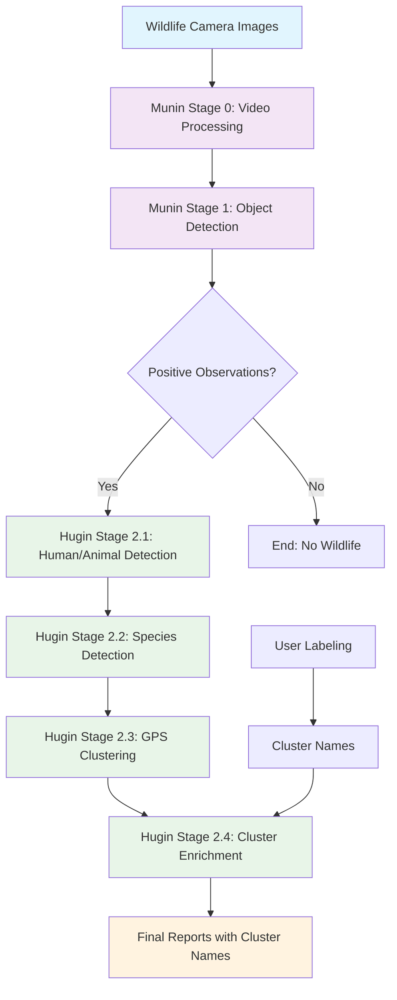

# 🐦‍⬛ Odins Ravne - Swedish Wildlife Intelligence System

**Munin** (Memory Keeper) samler og bevarer vildtdata fra kameraer, mens **Hugin** (Thought Bringer) giver dyb indsigt og forståelse af dyrelivet.

## 🎯 Projekt Oversigt

Odins Ravne er et omfattende system til svensk vildtmonitorering der kombinerer:
- **Munin**: Data indtagelse, procesering og lagring (Stage 0-2)
- **Hugin**: Analyse, indsigt og visualisering (Stage 2+)
- **Odin**: All-Father - Infrastruktur management og orchestration

## 🔄 System Workflow



### Workflow Stages

**Munin (Memory Keeper)**:
- **Stage 0**: Video frame ekstraktion og analyse
- **Stage 1**: Objekt detektion (positive observations)
- **Done**: Munin er færdig når der er konstateret positive observations

**Hugin (Thought Bringer)**:
- **Stage 2.1**: Menneske eller dyr detection
- **Stage 2.2**: Species detection (hvilket dyr)
- **Stage 2.3**: Dan cluster og data observations
- **Stage 2.4**: Berig med cluster navn for pretty reporting

## 🚀 Hurtig Start

### Forudsætninger
```bash
# Python 3.9+
pip install -r requirements.txt

# For GPU support (valgfrit)
pip install torch torchvision --index-url https://download.pytorch.org/whl/cu118
```

### Lokal Udvikling
```bash
# Odin - Infrastruktur Management
./scripts/odin --config odin.local.yaml infrastructure setup
./scripts/odin --config odin.local.yaml pipeline run

# Munin - Data Indtagelse
cd munin/
pip install -e .
munin ingest /path/to/images /path/to/output

# Hugin - Analyse
cd hugin/
pip install -e .
hugin analyze /path/to/data
```

### Cloud Deployment
```bash
# Odin - AWS Infrastructure
./scripts/odin --config odin.yaml infrastructure setup
./scripts/odin --config odin.yaml pipeline run

# AWS Setup (Legacy)
./scripts/infrastructure/deploy_aws_infrastructure.py
./scripts/infrastructure/create_aws_test_user.py

# Deploy to AWS Batch
odin batch --input s3://your-bucket/input --output s3://your-bucket/output
```

## 📁 Projekt Struktur

```
├── munin/                    # Memory Keeper (Data Indtagelse)
│   ├── src/munin/           # Core Munin moduler
│   ├── pyproject.toml      # Munin dependencies
│   └── README.md           # Munin dokumentation
├── hugin/                   # Thought Bringer (Analyse)
│   ├── src/hugin/          # Core Hugin moduler
│   ├── pyproject.toml      # Hugin dependencies
│   └── README.md           # Hugin dokumentation
├── src/odin/                # All-Father (Infrastruktur)
│   ├── cli.py              # Odin CLI interface
│   ├── config.py           # Configuration management
│   ├── infrastructure.py  # AWS infrastructure
│   ├── pipeline.py         # Pipeline orchestration
│   ├── local_infrastructure.py # Local infrastructure
│   └── local_pipeline.py   # Local pipeline
├── scripts/                 # Utility scripts
│   ├── odin                # Main Odin CLI
│   ├── test_local_odin.sh  # Local testing
│   ├── infrastructure/     # AWS/cloud setup
│   ├── image_tools/        # Billedbehandling utilities
│   └── data_upload/        # Cloud data management
├── docker-compose.local.yml # Local infrastructure
├── odin.yaml               # AWS configuration
├── odin.local.yaml         # Local configuration
└── docs/                   # Dokumentation
    ├── ROADMAP.md          # Udviklings roadmap
    ├── INFRASTRUCTURE.md   # Setup og deployment
    ├── LOCAL_SETUP.md      # Local development
    ├── COST_OPTIMIZATION.md # Cost optimization
    └── UTILITIES.md        # Tools og utilities
```

## 🐦‍⬛ Munin (Memory Keeper)

**Formål**: Data indtagelse, procesering og lagring (Stage 0-1)

**Nøglefunktioner**:
- **Stage 0**: Video frame ekstraktion og analyse
- **Stage 1**: Objekt detektion (positive observations)
- EXIF metadata procesering
- GPS lokationsklassifikation
- Cloud-optional arkitektur

**Munin er done** når den har lavet stage 1 og konstateret om der er positive observation.

### 🎥 Video Procesering
- **Frame Ekstraktion**: Ekstraher frames fra MP4, AVI, MOV, MKV videoer
- **Sampling Rate**: Konfigurerbar frame sampling (standard: 0.3 sekunder)
- **Batch Procesering**: Parallel video procesering med multiprocessing
- **GPU Acceleration**: CUDA-accelereret video dekodning
- **Format Support**: MP4, AVI, MOV, MKV, WebM, FLV, WMV

### 🦌 Vildt Detektion Modeller

#### **Swedish Wildlife Detector**
- **Optimeret til svenske arter**: Elg, vildsvin, rådyr, ræv, grævling
- **Misklassifikations korrektion**: Korrigerer automatisk almindelige COCO misklassifikationer
- **Art mapping**: Mapper generiske detektioner til svensk vildt
- **Confidence scoring**: Kalibrerede confidence scores for svenske arter

#### **Wildlife Detector (Generisk)**
- **YOLO-baseret detektion**: Standard YOLOv8 objekt detektion
- **COCO dataset support**: Alle 80 COCO klasser
- **Custom model support**: Indlæs custom trænede modeller
- **Batch processing**: Effektiv batch inference

#### **Detektion Pipeline**
```python
# Svensk Vildt Detektion
detector = SwedishWildlifeDetector(model_path="yolov8n.pt")
detections = detector.predict(image_path)

# Generisk Vildt Detektion  
detector = WildlifeDetector(model_path="custom_model.pt")
detections = detector.predict(image_path)
```

**CLI Kommandoer**:
```bash
munin ingest /input /output --extensions jpg,mp4
munin process /data --stage1 --stage2
munin upload /data --cloud aws
```

## 🧠 Hugin (Thought Bringer)

**Formål**: Analyse, indsigt og visualisering (Stage 2+)

**Nøglefunktioner**:
- **Stage 2.1**: Menneske eller dyr detection
- **Stage 2.2**: Species detection (hvilket dyr)
- **Stage 2.3**: Dan cluster og data observations
- **Stage 2.4**: Berig med cluster navn for pretty reporting
- GPS proximity clustering (5m radius)
- Data condensation med configurable time windows
- Decoupled labeling system

**CLI Kommandoer**:
```bash
# Hugin Stage 2 workflow
python -m hugin.post_s2_workflow process munin_results.json outputs/hugin_analysis

# GPS Cluster Management
python -m hugin.hugin_gps_cluster_management process observations.json outputs/clusters

# Cluster Tagging
python -m hugin.hugin_gps_cluster_management cluster request-unknown --limit 20
python -m hugin.hugin_gps_cluster_management cluster submit-names labels.yaml
```

## ⚡ Odin (All-Father)

**Formål**: Infrastruktur management og orchestration

**Nøglefunktioner**:
- AWS infrastruktur setup og teardown
- Lokal udvikling med Docker
- Pipeline orchestration
- Cost optimization
- Resource management

### 🏗️ Infrastruktur Management
- **AWS Setup**: CloudFormation, Batch, S3, IAM
- **Local Setup**: Docker Compose, LocalStack, MinIO
- **Cost Optimization**: Spot instances, auto-scaling
- **Resource Monitoring**: Real-time status og costs

### 🚀 Pipeline Orchestration
- **Stage Management**: Stage 0-3 pipeline execution
- **Batch Processing**: AWS Batch job submission
- **Local Processing**: Docker container execution
- **Data Management**: S3 upload/download, cleanup

**CLI Kommandoer**:
```bash
# Infrastructure Management
./scripts/odin --config odin.local.yaml infrastructure setup
./scripts/odin --config odin.local.yaml infrastructure teardown
./scripts/odin --config odin.local.yaml infrastructure status

# Pipeline Execution
./scripts/odin --config odin.local.yaml pipeline run
./scripts/odin --config odin.local.yaml pipeline stage1
./scripts/odin --config odin.local.yaml pipeline stage2
./scripts/odin --config odin.local.yaml pipeline stage3

# Data Management
./scripts/odin --config odin.local.yaml data upload
./scripts/odin --config odin.local.yaml data download
./scripts/odin --config odin.local.yaml data list

# Cost Management
./scripts/odin --config odin.local.yaml cost report
./scripts/odin --config odin.local.yaml cost optimize
```

## 🛠️ Teknologi Stack

### Core Teknologier
- **Python 3.9+**: Hovedudviklingssprog
- **PyTorch**: Machine learning framework
- **YOLOv8**: Objekt detektion modeller
- **OpenCV**: Billed/video procesering
- **FastAPI**: Web API framework

### Video Procesering Teknologier
- **PyAV**: Højydelses video frame ekstraktion
- **Decord**: GPU-accelereret video dekodning
- **FFmpeg**: Video format konvertering og procesering
- **CUDA**: GPU acceleration til video procesering
- **Multiprocessing**: Parallel video procesering

### Vildt Detektion Teknologier
- **YOLOv8**: State-of-the-art objekt detektion
- **Swedish Wildlife Detector**: Custom art mapping
- **COCO Dataset**: 80-klasse objekt detektion
- **TensorRT**: GPU inference optimering
- **ONNX**: Cross-platform model deployment

### Cloud Teknologier
- **AWS**: S3, Batch, ECR, CloudFormation
- **Docker**: Containerisering
- **LocalStack**: AWS API emulator
- **MinIO**: S3-compatible storage
- **Redis**: Caching og job queues
- **PostgreSQL**: Metadata storage

### Data Formater
- **Parquet**: Kolonne data lagring
- **JSONL**: Manifest filer
- **SQLite**: Lokal database
- **CSV**: Eksport format

## 📊 Nuværende Status

### ✅ Completed (Munin)
- Core pipeline implementering (Stage 0-2)
- Svensk vildt detektion optimering
- Video procesering med frame ekstraktion
- Flere vildt detektor modeller
- Cloud-optional arkitektur
- AWS infrastruktur setup
- Sikkerhed implementering
- Omfattende testning

### ✅ Completed (Odin)
- Infrastruktur management system
- AWS og lokal setup
- Pipeline orchestration
- Cost optimization
- Docker Compose setup
- LocalStack integration
- CLI interface

### ✅ Completed (Hugin)
- **Stage 2.1**: Menneske eller dyr detection
- **Stage 2.2**: Species detection (hvilket dyr)
- **Stage 2.3**: GPS proximity clustering (5m radius)
- **Stage 2.4**: Cluster enrichment med navne
- GPS cluster management system
- Data condensation med time windows
- Decoupled labeling workflow
- Cluster-aware analytics
- YAML-based workflow configuration

### 📋 Roadmap
Se [ROADMAP.md](docs/ROADMAP.md) for detaljeret udviklingsplan.

## 🔧 Setup & Deployment

- **Lokal Setup**: [LOCAL_SETUP.md](docs/LOCAL_SETUP.md)
- **Infrastruktur**: [INFRASTRUCTURE.md](docs/INFRASTRUCTURE.md)
- **Cost Optimering**: [COST_OPTIMIZATION.md](docs/COST_OPTIMIZATION.md)
- **Utilities & Tools**: [UTILITIES.md](docs/UTILITIES.md)

## 🤝 Bidrag

1. Fork repository
2. Opret feature branch
3. Lav dine ændringer
4. Tilføj tests
5. Submit pull request

## 📄 Licens

Dette projekt er licenseret under MIT License - se LICENSE filen for detaljer.

## 🐦‍⬛ Odins Ravne Team

- **Munin**: Memory Keeper - Data indtagelse og procesering
- **Hugin**: Thought Bringer - Analyse og indsigt
- **Odin**: All-Father - Overordnet system arkitektur

---

**Odins Ravne** - Bringer visdom til vildtbeskyttelse gennem teknologi.