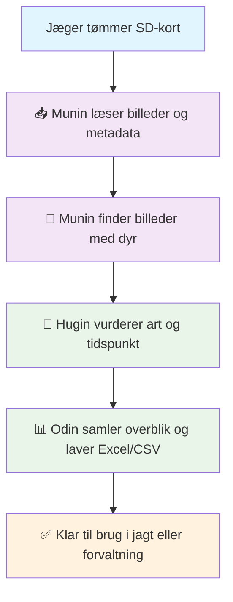
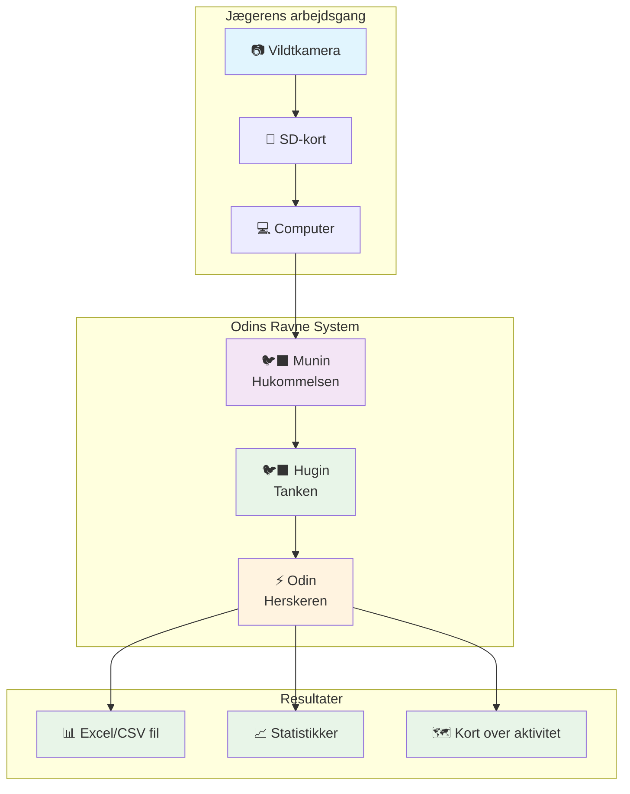

# 🐦‍⬛ Odins Ravne – Vildtovervågning med Munin & Hugin

[](https://github.com/leeth/swedish_wildlife_cam/actions)
[](https://codecov.io/gh/leeth/swedish_wildlife_cam)

## 🔍 Hvad er det?

Forestil dig, at dine vildtkameraer selv kunne fortælle dig:
- Hvilke dyr, der har været forbi
- Hvornår de kom
- Hvor ofte det sker

**Odins Ravne** er et system, der gør netop det.

Systemet består af tre dele, opkaldt efter nordisk mytologi:

- 🐦‍⬛ **Munin** – hukommelsen: han samler billederne og finder de interessante
- 🐦‍⬛ **Hugin** – tanken: han analyserer, hvad der ses, og hvilke dyr der er på billederne
- ⚡ **Odin** – herskeren: han styrer hele processen og gemmer resultaterne til dig

---

## 🎯 Hvorfor?

Vildtkameraer giver masser af billeder — men også masser af arbejde.

- Man skal kigge tusindvis af billeder igennem manuelt
- De fleste billeder viser ingenting
- Selv når man ser et dyr, skal man skrive ned hvad og hvornår

👉 Med Odins Ravne kan du få det hele automatisk – og spare tid, fejl og frustration.

---

## ⚡ Prøv dette på 10 minutter

```bash
# 1. Setup miljø
python3 -m venv .venv && source .venv/bin/activate
pip install -r requirements.txt

# 2. Start lokale services
make up-localstack

# 3. Deploy infrastruktur
make deploy-local

# 4. Kør test batch
make run-local

# 5. Tjek resultater
ls -la output/
```

**Forventet output:** Parquet filer med vildt detektioner, vejrdata og GPS clustering.

## 🧠 Hvordan virker det?

Når du kommer hjem fra jagten med et SD-kort fra dit kamera, gør du følgende:

1. **Sæt det i din computer**
2. **Kør Munin** – han finder billeder med aktivitet (dyr)
3. **Send dem videre til Hugin** – han vurderer, hvilket dyr der er på billedet
4. **Odin** samler det hele i en fil, du kan åbne i f.eks. Excel

---

## 🗺️ Visuelt overblik



## 🏗️ Systemarkitektur



## 🎯 Hvad kan systemet?

### 🐦‍⬛ Munin (Hukommelsen)
- **Finder interessante billeder**: Automatisk detektering af dyr på billeder
- **Læser metadata**: GPS-koordinater, tidspunkt, kamera-indstillinger
- **Filtrerer støj**: Ignorerer tomme billeder og falske alarmer
- **Organiserer data**: Strukturerer billeder efter tid og sted

### 🐦‍⬛ Hugin (Tanken)
- **Genkender arter**: Identificerer hvilke dyr der er på billederne
- **Analyserer adfærd**: Spor, aktivitetsmønstre og tidsintervaller
- **Grupperer observationer**: Finder sammenhænge mellem forskellige billeder
- **Vurderer kvalitet**: Bedømmer hvor pålidelig hver observation er

### ⚡ Odin (Herskeren)
- **Styrer processen**: Koordinerer Munin og Hugin
- **Samler resultater**: Laver overblik over alle observationer
- **Eksporterer data**: Skaber Excel/CSV filer til videre analyse
- **Optimerer ydeevne**: Sikrer hurtig og effektiv behandling

## 📊 Eksempel på resultater

Efter behandling får du en fil med:

| Dato | Tid | Sted | Art | Antal | Kvalitet | Billede |
|------|-----|------|-----|-------|----------|---------|
| 2024-01-15 | 14:30 | GPS: 59.3, 18.1 | Rådyr | 2 | Høj | [link] |
| 2024-01-15 | 16:45 | GPS: 59.3, 18.1 | Rådyr | 1 | Høj | [link] |
| 2024-01-16 | 08:20 | GPS: 59.3, 18.1 | Vildsvin | 3 | Medium | [link] |

## 🚀 Kom i gang

### Hurtig start
1. **Download systemet** fra GitHub
2. **Installer Python** (version 3.13+)
3. **Kør kommandoen**: `python -m src.munin.cli ingest /sti/til/billeder /sti/til/output`
4. **Åbn resultatfilen** i Excel eller lignende

### Detaljeret setup
Se [teknisk dokumentation](src/README.md) for fuld installationsguide.

## 🎯 Fordele

### ⏰ Tidsbesparelse
- **Før**: Timer med manuel gennemgang af tusindvis af billeder
- **Efter**: Automatisk behandling på minutter

### 🎯 Præcision
- **Før**: Menneskelige fejl og oversete detaljer
- **Efter**: Konsistent og objektiv analyse

### 📊 Indsigt
- **Før**: Ad-hoc noter og ustrukturerede data
- **Efter**: Systematiske data til videnskabelig analyse

### 💰 Økonomi
- **Før**: Mange timer med manuel arbejde
- **Efter**: Automatisering giver tid til andre opgaver

## 🔧 Teknisk oversigt

Odins Ravne er bygget med moderne teknologi:
- **Python 3.13**: Hovedprogrammeringssprog
- **Machine Learning**: Avancerede algoritmer til dyregenkendelse
- **Cloud-optional**: Virker både lokalt og i skyen
- **Skalerbar**: Kan håndtere fra få til tusindvis af billeder

## 📞 Support og udvikling

- **GitHub**: [wildlife_pipeline_starter](https://github.com/your-repo)
- **Dokumentation**: [Teknisk guide](src/README.md)
- **Issues**: Rapporter problemer via GitHub
- **Licens**: MIT - fri brug og modificering

---

**Odins Ravne** - Bringer visdom til vildtbeskyttelse gennem teknologi 🐦‍⬛