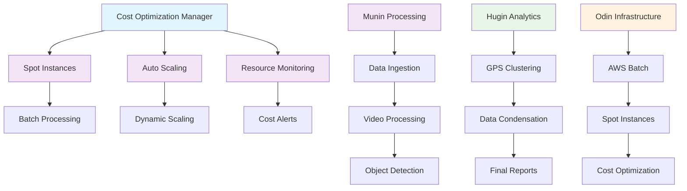

# 💰 Cost Optimization Guide

**Odins Ravne** - Cost optimization features for hyper batch-oriented processing

## 🚀 Quick Start

### Prerequisites
```bash
# AWS CLI configured
aws configure

# Python dependencies
pip install -r requirements.txt

# Install Munin and Hugin
cd src/munin/ && pip install -e .
cd ../hugin/ && pip install -e .
```

## 💰 Cost Optimization Architecture



### Deploy Cost-Optimized Infrastructure
```bash
# Deploy complete cost-optimized infrastructure
python scripts/infrastructure/deploy_cost_optimized_infrastructure.py --complete

# Or deploy specific components
python scripts/infrastructure/deploy_cost_optimized_infrastructure.py --cf
python scripts/infrastructure/deploy_cost_optimized_infrastructure.py --lambda
```

## 🏗️ Cost Optimization Features

### 1. Spot Instances with Fallback
- **Spot instances**: Up to 70% cost savings
- **Automatic fallback**: Falls back to on-demand if spot unavailable
- **Intelligent selection**: Chooses optimal instance types based on pricing

### 2. Infrastructure Lifecycle Management
- **Setup on demand**: Infrastructure scales up when jobs start
- **Teardown when done**: Infrastructure scales down to 0 when complete
- **Hyper batch-oriented**: Perfect for batch processing workloads

### 3. Stage 3 Output Download
- **Local download**: Downloads Stage 3 output to local filesystem
- **Cost optimization**: Only downloads when needed
- **Local analysis**: Run Stage 3 analysis locally

## 📋 Usage Examples

### Run Complete Cost-Optimized Pipeline
```bash
# Process images with cost optimization
scripts/infrastructure/run_cost_optimized_pipeline.sh /path/to/images/*.jpg

# Process videos with custom output directory
scripts/infrastructure/run_cost_optimized_pipeline.sh \
  --local-output ./results \
  /path/to/videos/*.mp4

# High priority processing
scripts/infrastructure/run_cost_optimized_pipeline.sh \
  --priority high \
  /path/to/urgent/data/*.jpg
```

### Download Existing Stage 3 Output
```bash
# Download Stage 3 output from cloud
scripts/infrastructure/run_cost_optimized_pipeline.sh \
  --download-only \
  --local-output ./stage3_results
```

### Analyze Local Stage 3 Data
```bash
# Analyze downloaded Stage 3 data
scripts/infrastructure/run_cost_optimized_pipeline.sh \
  --analyze-only \
  --local-output ./stage3_results
```

### Check Infrastructure Status
```bash
# Check compute environment status
scripts/infrastructure/run_cost_optimized_pipeline.sh --status

# Check cost metrics
scripts/infrastructure/run_cost_optimized_pipeline.sh --costs
```

## 🔧 Advanced Usage

### Manual Cost Optimization Management
```bash
# Setup infrastructure
python scripts/infrastructure/cost_optimization_manager.py \
  --action setup \
  --job-count 10 \
  --gpu-required

# Submit batch job
python scripts/infrastructure/cost_optimization_manager.py \
  --action submit-job \
  --job-name "my-job" \
  --job-parameters '{"input_path": "/data/images"}'

# Teardown infrastructure
python scripts/infrastructure/cost_optimization_manager.py \
  --action teardown
```

### Batch Workflow Management
```bash
# Create batch configuration
python scripts/infrastructure/batch_workflow_manager.py \
  --action create-config \
  --input-data /path/to/data1 /path/to/data2 \
  --job-type image_processing \
  --gpu-required \
  --output batch_config.json

# Process batch
python scripts/infrastructure/batch_workflow_manager.py \
  --action process-batch \
  --batch-config batch_config.json \
  --output batch_result.json
```

### Stage 3 Output Download
```bash
# Download Stage 3 output
python scripts/infrastructure/stage3_output_downloader.py \
  --cloud-path "s3://bucket/output" \
  --local-path "./stage3_output" \
  --summary \
  --create-runner
```

## 💡 Cost Optimization Strategies

### 1. Spot Instance Configuration
```yaml
# profiles/cloud-cost-optimized.yaml
cloud:
  aws:
    compute:
      spot_instances: true
      bid_percentage: 70
      fallback_to_ondemand: true
      max_vcpus: 100
      min_vcpus: 0
      desired_vcpus: 0  # Scale to zero when idle
```

### 2. Batch Processing Configuration
```yaml
pipeline:
  cost_optimization:
    enabled: true
    spot_preferred: true
    fallback_timeout: 300  # 5 minutes
    cost_threshold: 0.5    # 50% savings threshold
    max_parallel_jobs: 10
```

### 3. Storage Optimization
```yaml
storage:
  lifecycle:
    transition_to_ia: 30    # days
    transition_to_glacier: 90  # days
    delete_old_versions: 30  # days
```

## 📊 Cost Monitoring

### CloudWatch Dashboard
- **Job metrics**: Running, pending, failed jobs
- **Instance metrics**: CPU, memory, network usage
- **Storage metrics**: S3 bucket size and object count
- **Cost metrics**: Spot vs on-demand pricing

### Cost Reports
```bash
# Get cost metrics
python scripts/infrastructure/cost_optimization_manager.py --action costs

# Generate cost report
python scripts/infrastructure/batch_workflow_manager.py --action costs
```

## 🛠️ Troubleshooting

### Common Issues

#### 1. Spot Instance Interruptions
```bash
# Check spot instance status
aws ec2 describe-spot-instance-requests --region eu-north-1

# Monitor spot pricing
aws ec2 describe-spot-price-history \
  --instance-types g4dn.xlarge \
  --product-descriptions "Linux/UNIX" \
  --region eu-north-1
```

#### 2. Infrastructure Scaling Issues
```bash
# Check compute environment status
python scripts/infrastructure/cost_optimization_manager.py --action status

# Force teardown
python scripts/infrastructure/cost_optimization_manager.py --action teardown
```

#### 3. Stage 3 Download Issues
```bash
# Check S3 permissions
aws s3 ls s3://your-bucket/output/stage3/

# Test download manually
python scripts/infrastructure/stage3_output_downloader.py \
  --cloud-path "s3://your-bucket/output" \
  --local-path "./test_download"
```

## 🔒 Security Considerations

### IAM Permissions
The cost optimization features require additional IAM permissions:

```json
{
  "Version": "2012-10-17",
  "Statement": [
    {
      "Effect": "Allow",
      "Action": [
        "ec2:DescribeSpotPriceHistory",
        "ec2:DescribeSpotFleetRequests",
        "ec2:RequestSpotFleet",
        "ec2:CancelSpotFleetRequests",
        "batch:UpdateComputeEnvironment",
        "batch:DescribeComputeEnvironments"
      ],
      "Resource": "*"
    }
  ]
}
```

### Cost Controls
- **Budget alerts**: Set up AWS Budgets for cost monitoring
- **Resource tagging**: Tag resources for cost allocation
- **Access logging**: Enable CloudTrail for audit trails

## 📈 Performance Optimization

### Instance Type Selection
The system automatically selects optimal instance types based on:
- **Spot pricing**: Current spot prices
- **Availability**: Spot instance availability
- **Performance**: GPU requirements
- **Cost**: Price per vCPU hour

### Batch Processing Optimization
- **Parallel processing**: Multiple jobs run simultaneously
- **Resource sharing**: Efficient resource utilization
- **Queue management**: Priority-based job scheduling

## 🎯 Best Practices

### 1. Cost Optimization
- **Use spot instances**: 50-70% cost savings
- **Scale to zero**: Infrastructure scales down when idle
- **Batch processing**: Process multiple jobs together
- **Local analysis**: Download and analyze locally

### 2. Performance
- **GPU instances**: Use GPU instances for ML workloads
- **Parallel processing**: Process multiple jobs simultaneously
- **Resource monitoring**: Monitor resource utilization

### 3. Reliability
- **Fallback strategy**: Fall back to on-demand if spot unavailable
- **Retry logic**: Retry failed jobs automatically
- **Error handling**: Proper error handling and logging

## 📚 Additional Resources

- [AWS Spot Instances Documentation](https://docs.aws.amazon.com/AWSEC2/latest/UserGuide/using-spot-instances.html)
- [AWS Batch Documentation](https://docs.aws.amazon.com/batch/)
- [Cost Optimization Best Practices](https://aws.amazon.com/pricing/cost-optimization/)
- [CloudFormation Templates](aws/cloudformation-template-cost-optimized.yaml)

## 🤝 Support

For issues and questions:
- **GitHub Issues**: Create an issue in the repository
- **Documentation**: Check this guide and inline documentation
- **AWS Support**: For AWS-specific issues

---

**Happy cost-optimized processing! 🚀💰**
