# 🎨 PlantUML Diagrams for Odins Ravne

Dette dokument indeholder PlantUML diagrammer der konverterer alle Mermaid diagrammer fra dokumentationen.

## 🔄 System Workflow

### Main System Workflow

```plantuml
@startuml System Workflow
!theme plain
skinparam backgroundColor #FFFFFF
skinparam activity {
    BackgroundColor #E1F5FE
    BorderColor #1976D2
    FontColor #000000
}
skinparam activityDiamond {
    BackgroundColor #FFF3E0
    BorderColor #F57C00
    FontColor #000000
}

start
:Wildlife Camera Images;
:Munin Stage 0: Video Processing;
:Munin Stage 1: Object Detection;
if (Positive Observations?) then (Yes)
    :Hugin Stage 2.1: Human/Animal Detection;
    :Hugin Stage 2.2: Species Detection;
    :Hugin Stage 2.3: GPS Clustering;
    :Hugin Stage 2.4: Cluster Enrichment;
    :Final Reports with Cluster Names;
    stop
else (No)
    :End: No Wildlife;
    stop
endif

note right
    User Labeling
    ↓
    Cluster Names
    ↓
    Cluster Enrichment
end note
@enduml
```


### Munin (Memory Keeper) - Stages 0-1


### Hugin (Thought Bringer) - Stages 2.1-2.4


## 🗺️ GPS Clustering Workflow


## 📊 Data Condensation Workflow


## 🏷️ User Labeling Workflow

```plantuml
@startuml User Labeling
!theme plain
skinparam backgroundColor #FFFFFF
skinparam activity {
    BackgroundColor #E8F5E8
    BorderColor #4CAF50
    FontColor #000000
}
skinparam activityDiamond {
    BackgroundColor #FFF3E0
    BorderColor #F57C00
    FontColor #000000
}

start
:Unknown Clusters;
:Request Labels;
:YAML Template;
:User Edits;
:Submit Labels;
:Cluster Names;
:Enriched Reports;

note right
    Overlap Detection
    ↓
    Merge Requests
    ↓
    User Approval
    ↓
    Merged Clusters
    ↓
    New Names
    ↓
    Cluster Names
end note
@enduml
```



## 🏗️ System Integration


## 🏗️ Infrastructure Architecture


## 📊 Data Flow Architecture

```plantuml
@startuml Data Flow
!theme plain
skinparam backgroundColor #FFFFFF
skinparam component {
    BackgroundColor #E1F5FE
    BorderColor #1976D2
    FontColor #000000
}
skinparam package {
    BackgroundColor #F3E5F5
    BorderColor #7B1FA2
    FontColor #000000
}

package "Input" {
    [Wildlife Camera Images] as Input
    [Video Files] as Video
    [Image Files] as Images
}

package "Processing" {
    [Munin Stage 0] as M0
    [Munin Stage 1] as M1
    [Hugin Stage 2.1] as H1
    [Hugin Stage 2.2] as H2
    [Hugin Stage 2.3] as H3
    [Hugin Stage 2.4] as H4
}

package "Output" {
    [Final Reports] as Output
    [Cluster Names] as Clusters
    [Analytics] as Analytics
}

Input --> M0
Video --> M0
Images --> M0
M0 --> M1
M1 --> H1
H1 --> H2
H2 --> H3
H3 --> H4
H4 --> Output
H4 --> Clusters
H4 --> Analytics
@enduml
```

## 🔧 Component Architecture


## 📈 Performance Monitoring


## 🚀 Deployment Pipeline


## 📋 Usage Instructions

### Online PlantUML Viewer
1. Gå til [PlantUML Online Server](http://www.plantuml.com/plantuml/uml/)
2. Kopier PlantUML koden fra ovenstående diagrammer
3. Indsæt koden i textarea'en
4. Klik "Submit" for at generere diagrammet

### Local PlantUML Installation
```bash
# Install PlantUML
sudo apt-get install plantuml

# Generate PNG from PlantUML file
plantuml diagram.puml

# Generate SVG from PlantUML file
plantuml -tsvg diagram.puml
```

### VS Code Extension
1. Installer "PlantUML" extension i VS Code
2. Åbn PlantUML filer med `.puml` extension
3. Brug `Alt+D` for at preview diagrammet

## 🎨 Customization

### Colors and Themes
```plantuml
!theme plain
skinparam backgroundColor #FFFFFF
skinparam component {
    BackgroundColor #E1F5FE
    BorderColor #1976D2
    FontColor #000000
}
```

### Layout Options
```plantuml
!define DIRECTION top to bottom
!define DIRECTION left to right
!define DIRECTION bottom to top
!define DIRECTION right to left
```

---

**PlantUML Diagrams Status:** ✅ **ACTIVE**  
**Last Updated:** 2025-09-28  
**Version:** 1.0
