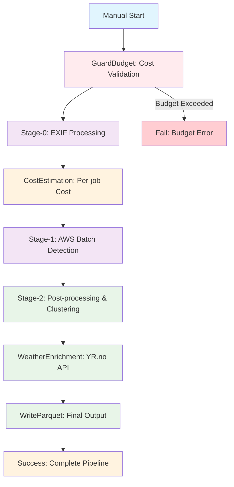

# Wildlife Pipeline - Step Functions Architecture

This document describes the refactored wildlife pipeline using AWS Step Functions with weather enrichment as a dedicated step.

## Architecture Overview

The pipeline is now orchestrated as a manual, budget-controlled Step Functions workflow:

```
GuardBudget → Stage-0 (EXIF/time-fix) → Stage-1 (detection via AWS Batch) → Stage-2 (post/cluster) → WeatherEnrichment → WriteParquet → Done
```

## Key Features

### 🎯 **Budget-First Design**
- Budget is a first-class parameter: `{ budget_dkk, use_spot, max_job_duration, max_images }`
- GuardBudget step validates cost estimates before starting
- Fails fast if estimated cost exceeds budget

### 🚀 **Manual Execution Only**
- No scheduler - only manual start via Console/CLI
- Perfect for ad-hoc wildlife data processing
- Full control over when and what to process

### 🌤️ **Weather Enrichment Integration**
- Weather enrichment is now a dedicated Step Functions step
- Enriches only positive wildlife observations
- Uses YR.no API for historical weather data
- Efficient and cost-effective

### 🏗️ **Hybrid Compute Strategy**
- Stage-1 runs as AWS Batch job (spot-compute enabled)
- Stage-0 and Stage-2 run in Lambda (small batches)
- Weather enrichment runs in Lambda
- Optimal cost/performance balance

## Step Functions Workflow

### Mermaid Architecture Diagram



### State Machine Definition

The workflow is defined in CloudFormation template with the following states:

1. **GuardBudget** - Validates budget constraints
2. **Stage0Exif** - EXIF data extraction and time correction
3. **CostEstimation** - Per-job cost calculation
4. **SubmitBatchStage1** - Wildlife detection via AWS Batch
5. **Stage2Post** - Post-processing and clustering
6. **WeatherEnrichment** - Weather data enrichment
7. **WriteParquet** - Final output generation

### State Definition Extract

```json
{
  "Comment": "Wildlife pipeline: budget-guarded manual workflow with weather enrichment",
  "StartAt": "GuardBudget",
  "States": {
    "GuardBudget": {
      "Type": "Task",
      "Resource": "arn:aws:states:::lambda:invoke",
      "OutputPath": "$.Payload",
      "Parameters": {
        "FunctionName": "${GuardBudgetLambda}",
        "Payload.$": "$"
      },
      "Catch": [
        {
          "ErrorEquals": ["BudgetExceeded"],
          "ResultPath": "$.error",
          "Next": "FailBudget"
        }
      ],
      "Next": "Stage0Exif"
    },
    "Stage0Exif": {
      "Type": "Task",
      "Resource": "arn:aws:states:::lambda:invoke",
      "OutputPath": "$.Payload",
      "Parameters": {
        "FunctionName": "${Stage0ExifLambda}",
        "Payload.$": "$"
      },
      "Next": "CostEstimation"
    },
    "CostEstimation": {
      "Type": "Task",
      "Resource": "arn:aws:states:::lambda:invoke",
      "OutputPath": "$.Payload",
      "Parameters": {
        "FunctionName": "${CostEstimationLambda}",
        "Payload.$": "$"
      },
      "Next": "SubmitBatchStage1"
    },
    "SubmitBatchStage1": {
      "Type": "Task",
      "Resource": "arn:aws:states:::batch:submitJob.sync",
      "Parameters": {
        "JobName.$": "States.Format('munin-detector-{}', $.session_id)",
        "JobQueue": "${BatchJobQueue}",
        "JobDefinition": "${BatchJobDefinition}",
        "ContainerOverrides": {
          "Environment": [
            {
              "Name": "INPUT_URI",
              "Value.$": "$.stage0_output_uri"
            },
            {
              "Name": "OUTPUT_URI",
              "Value.$": "$.intermediate_uri"
            }
          ]
        },
        "RetryStrategy": {
          "Attempts": 1
        },
        "Timeout": {
          "AttemptDurationSeconds.$": "$.max_job_duration"
        }
      },
      "Next": "Stage2Post"
    },
    "Stage2Post": {
      "Type": "Task",
      "Resource": "arn:aws:states:::lambda:invoke",
      "OutputPath": "$.Payload",
      "Parameters": {
        "FunctionName": "${Stage2PostLambda}",
        "Payload.$": "$"
      },
      "Next": "WeatherEnrichment"
    },
    "WeatherEnrichment": {
      "Type": "Task",
      "Resource": "arn:aws:states:::lambda:invoke",
      "OutputPath": "$.Payload",
      "Parameters": {
        "FunctionName": "${WeatherEnrichmentLambda}",
        "Payload.$": "$"
      },
      "Next": "WriteParquet"
    },
    "WriteParquet": {
      "Type": "Task",
      "Resource": "arn:aws:states:::lambda:invoke",
      "OutputPath": "$.Payload",
      "Parameters": {
        "FunctionName": "${WriteParquetLambda}",
        "Payload.$": "$"
      },
      "Next": "Success"
    },
    "Success": {
      "Type": "Succeed"
    },
    "FailBudget": {
      "Type": "Fail",
      "Error": "BudgetExceeded",
      "Cause": "Estimated cost exceeds budget"
    }
  }
}
```

### Error Handling

- Budget exceeded → Fail with clear error message
- Batch job failure → Retry once, then fail
- Lambda timeouts → Automatic retry with exponential backoff

## Deployment Options

### LocalStack (Development)

```bash
# Start LocalStack
make up-localstack

# Deploy pipeline
make deploy-local

# Run pipeline
make run-local
```

### AWS (Production)

```bash
# Deploy to AWS
make deploy-aws

# Run pipeline
make run-aws
```

## Input Format

```json
{
  "input_uri": "s3://bucket/raw/cam01/",
  "output_uri": "s3://bucket/out/run_001/",
  "budget_dkk": 25,
  "use_spot": true,
  "max_images": 1500,
  "max_job_duration": 3600,
  "weather_days_back": 7
}
```

## Output Format

```json
{
  "session_id": "run-abc123",
  "final_results": {
    "parquet_uri": "s3://bucket/out/run_001/clusters.parquet",
    "report_uri": "s3://bucket/out/run_001/run_report.json",
    "weather_uri": "s3://bucket/out/run_001/weather/",
    "files_created": 2
  }
}
```

## Cost Estimation & Optimization

### Cost Calculation Formula

The budget guard system estimates costs based on:

- **Compute**: vCPU hours × pricing (spot vs on-demand)
- **Storage**: S3 storage costs with Intelligent-Tiering
- **Lambda**: Execution time and memory
- **Step Functions**: State transitions

### Per-Job Cost Estimation

```python
def calculate_job_cost(file_count: int, ms_per_frame: int, price_per_hour: float) -> dict:
    """Calculate cost estimate: filecount × ms/frame × price"""
    estimated_hours = (file_count * ms_per_frame) / (1000 * 60 * 60)
    estimated_cost = estimated_hours * price_per_hour
    
    return {
        'file_count': file_count,
        'estimated_hours': estimated_hours,
        'estimated_cost': estimated_cost,
        'cost_per_file': estimated_cost / file_count if file_count > 0 else 0
    }
```

### AWS Cost Optimization Features

#### Batch Compute Environment
- **Spot Instances**: 50% bid for cost savings
- **Limited Instance Families**: c5, m5 for predictable costs
- **Allocation Strategy**: SPOT_CAPACITY_OPTIMIZED
- **Max vCPUs**: 100 (configurable)

#### S3 Storage Optimization
- **Intelligent-Tiering**: Automatic cost optimization
- **Lifecycle Policies**: 
  - Standard → Standard-IA (30 days)
  - Standard-IA → Glacier (90 days)
  - Glacier → Deep Archive (365 days)
- **Automatic Cleanup**: Old frames (3 years), crops (2 years)

#### Budget Monitoring
- **CloudWatch Alarms**: $100 budget threshold
- **SNS Notifications**: Budget exceeded alerts
- **Cost Tracking**: Per-job cost estimates in logs

### Budget Configuration

```python
budget = Budget(
    max_dkk=25.0,
    mode=ComputeMode.HYBRID,
    max_runtime_min=60,
    max_images=1500,
    use_spot=True
)
```

## Weather Enrichment

### Process Flow

1. **Input**: Positive wildlife observations from Stage-2
2. **Processing**: Enrich each observation with weather data
3. **API**: YR.no for historical weather data
4. **Output**: Weather-enriched observations

### Weather Data Points

- Temperature, humidity, precipitation
- Wind speed, direction, gusts
- Pressure, visibility, cloud cover
- UV index, dew point

## LocalStack Development

### Services Included

- S3 (object storage)
- Lambda (serverless functions)
- Step Functions (workflow orchestration)
- Batch (containerized jobs)
- IAM (permissions)
- CloudWatch (logging)

### Docker Compose

```yaml
services:
  localstack:
    image: localstack/localstack:latest
    ports:
      - "4566:4566"
    environment:
      - SERVICES=s3,lambda,stepfunctions,batch,iam,cloudwatch
      - LAMBDA_EXECUTOR=docker-reuse
```

## AWS Production

### CloudFormation Stack

The pipeline is deployed using CloudFormation with:

- **IAM Roles**: Step Functions, Lambda, Batch execution roles
- **VPC**: Isolated network for Batch jobs
- **Batch**: Compute environment with spot instances
- **Lambda**: Serverless functions for each stage
- **Step Functions**: State machine orchestration

### Security

- VPC isolation for Batch jobs
- IAM least-privilege access
- S3 bucket encryption
- CloudTrail logging

## Monitoring and Logging

### CloudWatch Integration

- Step Functions execution logs
- Lambda function logs
- Batch job logs
- Custom metrics for cost tracking

### Observability

- Execution history in Step Functions console
- Real-time cost monitoring
- Performance metrics
- Error tracking and alerting

## Development Workflow

### Local Development

1. Start LocalStack: `make up-localstack`
2. Deploy pipeline: `make deploy-local`
3. Test execution: `make run-local`
4. Check logs: `make logs-local`

### Production Deployment

1. Build Docker images: `make build-docker`
2. Deploy to AWS: `make deploy-aws`
3. Run pipeline: `make run-aws`
4. Monitor execution in AWS Console

## Troubleshooting

### Common Issues

1. **Budget Exceeded**: Reduce `max_images` or increase `budget_dkk`
2. **Batch Job Timeout**: Increase `max_job_duration`
3. **Lambda Timeout**: Check function logs in CloudWatch
4. **S3 Permissions**: Verify IAM roles and policies

### Debug Commands

```bash
# Check LocalStack status
make status-local

# View execution logs
awslocal stepfunctions describe-execution --execution-arn <arn>

# List Lambda functions
awslocal lambda list-functions

# Check Batch job status
awslocal batch describe-jobs --jobs <job-id>
```

## Future Enhancements

### Planned Features

1. **Multi-Region Support**: Deploy across multiple AWS regions
2. **Auto-Scaling**: Dynamic Batch compute environment scaling
3. **Cost Optimization**: ML-based cost prediction
4. **Weather Providers**: Support for multiple weather APIs
5. **Real-time Monitoring**: Live cost and progress tracking

### Integration Opportunities

1. **SNS Notifications**: Pipeline completion alerts
2. **SQS Queues**: Asynchronous processing
3. **API Gateway**: REST API for pipeline management
4. **CloudFormation**: Infrastructure as Code
5. **Terraform**: Alternative IaC tool

## Conclusion

The Step Functions architecture provides:

- ✅ **Budget Control**: Prevent cost overruns
- ✅ **Manual Execution**: Full control over processing
- ✅ **Weather Integration**: Environmental context for wildlife data
- ✅ **LocalStack Support**: Local development and testing
- ✅ **AWS Production**: Scalable cloud deployment
- ✅ **Monitoring**: Full observability and logging

This architecture is perfect for wildlife researchers who need:
- Controlled, budget-aware processing
- Weather-enriched wildlife observations
- Local development capabilities
- Production-ready AWS deployment

