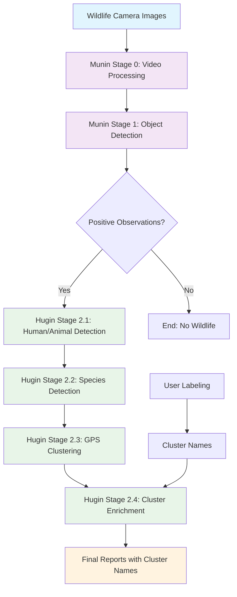
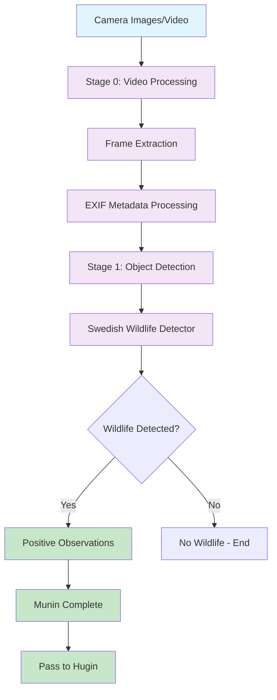
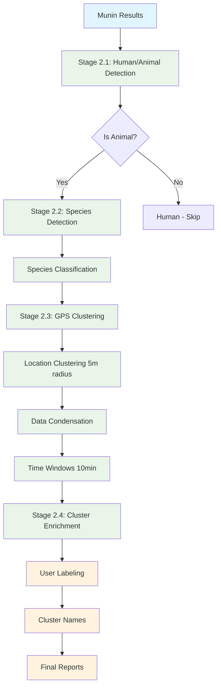
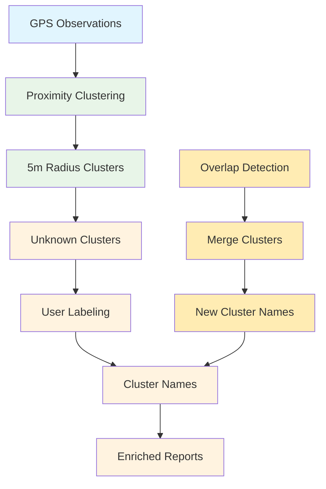
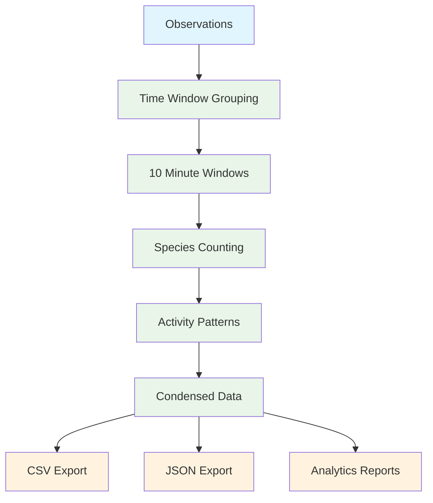
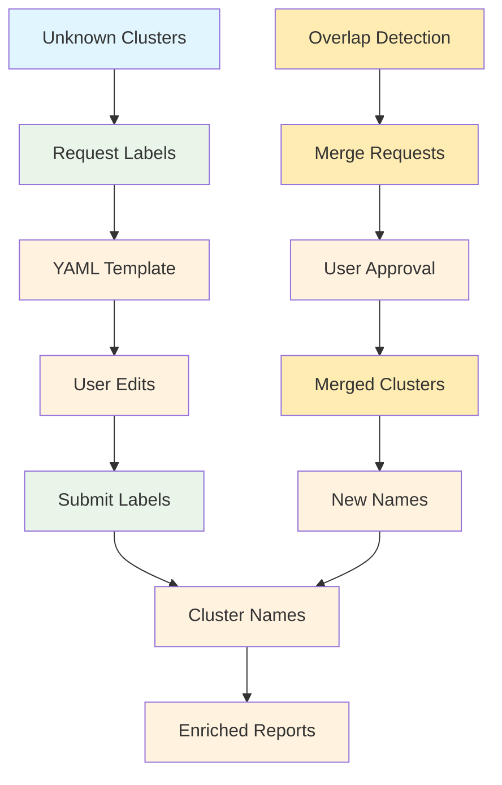
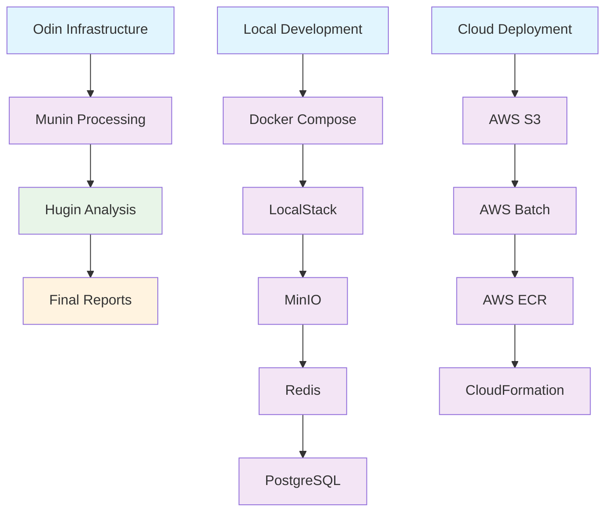

# Odins Ravne Workflow Diagram

Dette dokument indeholder det komplette workflow diagram for Odins Ravne systemet.

## System Overview

## Detailed Workflow

### Munin (Memory Keeper) - Stages 0-1

### Hugin (Thought Bringer) - Stages 2.1-2.4

## GPS Clustering Workflow

## Data Condensation Workflow

## User Labeling Workflow

## System Integration

## Key Features

### Munin (Memory Keeper)
- **Stage 0**: Video frame ekstraktion og analyse
- **Stage 1**: Objekt detektion (positive observations)
- **Done**: Munin er færdig når der er konstateret positive observations

### Hugin (Thought Bringer)
- **Stage 2.1**: Menneske eller dyr detection
- **Stage 2.2**: Species detection (hvilket dyr)
- **Stage 2.3**: Dan cluster og data observations
- **Stage 2.4**: Berig med cluster navn for pretty reporting

### Key Technologies
- **GPS Clustering**: 5m radius proximity clustering
- **Data Condensation**: Configurable time windows (10 min default)
- **Decoupled Labeling**: User naming separate from processing
- **YAML Workflows**: Configuration-driven processing
- **Cluster Analytics**: Species and temporal analysis by cluster
